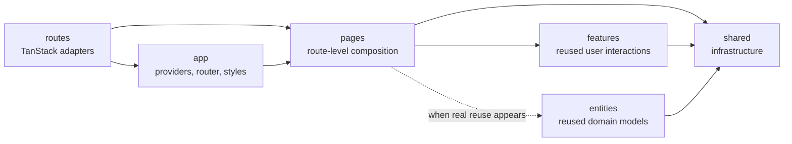

# Frontend architecture: Feature-Sliced Design

Status: accepted

The frontend follows Feature-Sliced Design (FSD) v2.1 with TanStack Start's
file-based router as a framework boundary. Route files stay in `src/routes`
because TanStack generates the route tree from that directory. They should be
thin adapters that validate URL state, run guards and loaders, and render a
page from `src/pages`.

The repository includes the official
[Feature-Sliced Design skill](../../.agents/skills/feature-sliced-design/SKILL.md)
as the executable architecture reference. The upstream methodology is
documented at [fsd.how](https://fsd.how).

## Dependency direction



Code may import only from lower layers. External consumers import a page,
feature, or entity through that slice's `index.ts`. Shared exposes one public
API per segment, for example `@/shared/ui` and `@/shared/api`.

## Current structure

```text
src/
├── app/
│   ├── runtime/          # Query/tRPC providers and app-wide tooling
│   ├── router/           # Request-scoped router and query client construction
│   └── styles/           # Global styles
├── routes/               # TanStack route definitions, -lib guards, URL validation
├── pages/                # Home, sign-in, sign-up, dashboard
├── features/
│   └── authentication/   # Auth interaction reused by multiple pages
└── shared/
    ├── api/              # Isomorphic tRPC client and API response types
    ├── auth/             # Better Auth client/session infrastructure
    ├── config/           # Validated environment configuration
    ├── lib/              # Generic helpers
    └── ui/               # Reusable UI kit
```

There is intentionally no empty `entities/` directory. Add an entity only
when a stable business model or business rule is already reused by at least
two consumers. Raw API response types remain in `shared/api`; authentication
session data remains in `shared/auth` or `shared/api`.

## Placement rules

- Keep page-specific UI, validation, loaders, queries, and mutations in that
  page slice.
- Extract a feature only after the same user interaction is used by multiple
  pages or widgets.
- Put reusable business models in `entities` only after real reuse exists.
- Put API client setup in `shared/api`, generic utilities in `shared/lib`,
  auth infrastructure in `shared/auth`, and generic components in
  `shared/ui`.
- Keep global providers, router construction, styles, analytics, and error
  boundaries in `app`.
- Keep `routes` free of page markup and domain workflows.

## Enforcement

Run the normal frontend lint and build checks after architectural changes.
Run `pnpm lint:architecture` to enforce FSD slice names, public APIs, and
import boundaries with the official Steiger linter.
