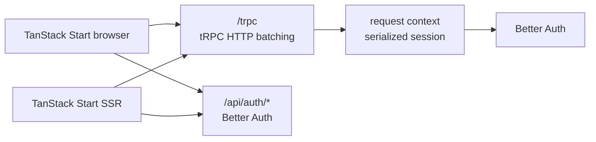

# API architecture: tRPC

Status: implemented

## Decision

The browser-facing application API uses tRPC 11 with its TanStack React Query
integration. Better Auth continues to own `/api/auth/*`; application RPC
procedures are mounted by the Express backend under `/trpc`.

This monorepo has TypeScript clients and a TypeScript server and already uses
Zod, Express, and TanStack Query. tRPC therefore provides end-to-end type
inference without Protocol Buffer generation or a browser-specific gRPC
transport.

The implementation follows the official [tRPC overview](https://trpc.io/),
[TanStack React Query integration](https://trpc.io/docs/client/tanstack-react-query/setup),
and [Express adapter](https://trpc.io/docs/server/adapters/express).

gRPC or ConnectRPC should be reconsidered if the API must support
non-TypeScript clients, independently deployed services, language-neutral
schemas, or high-volume streaming.

## Runtime flow



The backend creates the tRPC context once per HTTP request and resolves the
Better Auth session from the incoming cookie headers. The shared session
procedure is protected and returns a typed `UNAUTHORIZED` error when no session
exists. Its output is validated by Zod before it leaves the server.

Browser requests use `credentials: include`. SSR requests explicitly forward
the Better Auth session cookie to the backend.

## Backend ownership

```text
apps/backend/src/
├── errors/
│   ├── ApplicationError.ts        # Base application error contract
│   ├── BadRequestError.ts         # Global error categories
│   ├── ForbiddenError.ts
│   ├── NotFoundError.ts
│   ├── UnauthorizedError.ts
│   ├── UnprocessableContentError.ts
│   └── ValidationError.ts
├── trpc/
│   ├── context.ts                 # Request-scoped authentication context
│   ├── instance.ts                # tRPC initialization and error formatter
│   ├── procedures.ts              # Public and authenticated procedures
│   ├── errors/
│   │   ├── formatTRPCError.ts     # Serialized client error shape
│   │   ├── getTRPCErrorCode.ts    # Application category → tRPC code
│   │   └── toTRPCError.ts         # ApplicationError → native TRPCError
│   ├── middlewares/
│   │   ├── applicationErrorMiddleware.ts
│   │   └── authenticationMiddleware.ts
│   ├── router.ts                  # Composition root and AppRouter type
│   └── index.ts                   # Type-only frontend public API
└── modules/
    ├── example/
    │   ├── example.repository.ts  # Drizzle data access
    │   ├── example.service.ts     # Application behavior
    │   ├── example.router.ts      # Validation and tRPC procedures
    │   └── errors/
    │       └── ExampleMessageNotFoundError.ts
    └── session/
        ├── session.schema.ts
        └── session.router.ts
```

The backend owns the router runtime, services, repositories, and application
errors. The frontend imports `AppRouter` and `SessionResponse` only through
`backend/trpc` with `import type`, so backend code does not enter the browser
bundle. An ESLint boundary rejects runtime imports from the backend.

## Frontend integration

The tRPC transport lives in `src/shared/api`. Router construction in
`src/app/router` creates one tRPC client, options proxy, and QueryClient per
router instance. TanStack Start creates a fresh router for each SSR request, so
cached session data cannot leak between users. TanStack Router's Query
integration dehydrates the server cache and restores it in the browser.

The authenticated route uses
`queryClient.ensureQueryData(trpc.session.get.queryOptions())`. It redirects
only typed `UNAUTHORIZED` errors to sign-in and allows unexpected server or
network errors to reach the normal error boundary.

## GET and POST examples

The public `example` router demonstrates both directions of the integration:

| tRPC procedure          | HTTP transport                     | Purpose                                        |
| ----------------------- | ---------------------------------- | ---------------------------------------------- |
| `example.getMessage`    | `GET /trpc/example.getMessage`     | Reads a persisted PostgreSQL row by UUID       |
| `example.createMessage` | `POST /trpc/example.createMessage` | Creates and returns a persisted PostgreSQL row |

The home page consumes them with the recommended TanStack Query-native API:

```typescript
const trpc = useTRPC()

const message = useQuery(trpc.example.getMessage.queryOptions({ id }))

const createMessage = useMutation(trpc.example.createMessage.mutationOptions())
createMessage.mutate({ message: 'Hello from React' })
```

The example is intentionally in the home page slice because it currently has
one consumer. If the interaction becomes reusable, it can be extracted into a
feature later.

## Adding procedures

1. Add a domain-oriented slice under `apps/backend/src/modules`.
2. Keep database access in its repository and business decisions in its service.
3. Put module-specific errors in `modules/<module>/errors`, extending the
   appropriate global category error (and therefore `ApplicationError`).
4. Validate transport input/output in its tRPC router.
5. Compose the module router into `apps/backend/src/trpc/router.ts`.
6. Consume generated query or mutation options from `@/shared/api` in the FSD
   slice that owns the use case.
7. Add caller tests for success, validation, authorization, and expected error
   codes.

## Guarantees

- Better Auth routes and cookies remain unchanged.
- Unauthenticated session access returns a typed `UNAUTHORIZED` tRPC error.
- Authenticated browser and SSR requests return the same validated shape.
- Query caches are request-scoped during SSR and stable in the browser.
- Application errors stay in the backend. Their stable backend `code` is
  exposed as `applicationCode` by the tRPC formatter, while tRPC keeps ownership
  of the transport-level `code` field.
- The previous ts-rest runtime and dependencies have been removed.
