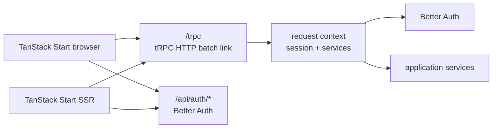

# API migration: ts-rest to tRPC

Status: proposed

## Decision

Adopt tRPC 11 with its TanStack React Query integration instead of gRPC for
the browser-facing application API.

This monorepo has TypeScript clients and a TypeScript server, already uses
Zod, Express, and TanStack Query, and does not currently need language-neutral
clients. tRPC therefore preserves end-to-end inference without adding
Protocol Buffer generation or a gRPC-Web/Connect transport layer.

The recommendation is based on the current official
[tRPC overview](https://trpc.io/), the
[TanStack React Query integration](https://trpc.io/docs/client/tanstack-react-query/setup),
and the [tRPC context model](https://trpc.io/docs/server/context).

gRPC or ConnectRPC should be reconsidered if the API must support non-TypeScript
clients, independently deployed services, strict language-neutral schemas, or
high-volume streaming. Native gRPC is not directly available to browsers;
browser clients require gRPC-Web or a compatible protocol.

## Current state

- ts-rest is used only for `GET /api/session`.
- Better Auth owns `/api/auth/*` and should remain unchanged.
- The frontend wraps ts-rest and TanStack Query in a single shared client.
- The current ts-rest packages are pinned to `3.53.0-rc.1`.

The ts-rest repository is not archived, but the installed version is a
pre-release published on 2025-06-02 and upstream activity has slowed. That is
enough reason to remove the dependency deliberately, but not to rush a
big-bang migration.

## Target boundary



Use `@trpc/tanstack-react-query`, which tRPC 11 recommends over its classic
React Query client. Reuse the existing QueryClient and create a new QueryClient
per SSR request so caches are never shared between users.

## Package design

Evolve `packages/contracts` into an API package rather than importing types
directly from one app into another:

```text
packages/api/
├── src/context.ts             # Context interface, no Express dependency
├── src/trpc.ts                # initTRPC, procedures and middleware
├── src/router.ts              # appRouter and exported AppRouter type
└── src/session/
    ├── session.schema.ts      # Zod output schema
    └── session.router.ts      # session.get procedure
```

The backend supplies the request-scoped context implementation. Context should
contain the authenticated session and application services/repositories, not
raw global state. This keeps Better Auth and database infrastructure in the
backend while letting the API package expose `AppRouter` to the frontend with
a type-only import.

## Migration phases

1. Add characterization tests for authenticated and unauthenticated session
   responses before changing transport code.
2. Introduce the API package with `@trpc/server`, the context contract,
   `appRouter`, and a `session.get` query with Zod output validation.
3. Mount the Express tRPC adapter at `/trpc` beside the existing Better Auth
   and ts-rest endpoints. Create context once per request and derive the
   session from the incoming cookie headers.
4. Add the isomorphic frontend client in `shared/api` using
   `@trpc/client` and `@trpc/tanstack-react-query`. Browser calls use
   credentials; SSR calls explicitly forward the Better Auth cookie.
5. Migrate the authenticated route guard and dashboard session query to
   `session.get`. Keep the ts-rest endpoint active during this phase.
6. Verify status/error mapping, cookie forwarding, SSR cache isolation,
   batching, redirects, and the signed-in dashboard flow.
7. Remove the ts-rest route, client provider, `packages/contracts`, and all
   three `@ts-rest/*` dependencies after no consumers remain.
8. Rename `packages/contracts` to `packages/api` in a separate mechanical
   change, or keep the package name temporarily if minimizing diff size is
   more important.

## Acceptance criteria

- Unauthenticated session access produces a typed `UNAUTHORIZED` tRPC error
  and redirects to sign-in.
- Authenticated browser and SSR requests return the same session shape.
- Better Auth routes and cookies are unchanged.
- The frontend imports `AppRouter` with `import type`; no backend runtime
  module enters the browser bundle.
- Query caches are request-scoped on the server and stable in the browser.
- No `@ts-rest/*` packages or imports remain after the final phase.
- Backend integration tests and frontend build/lint checks pass.
