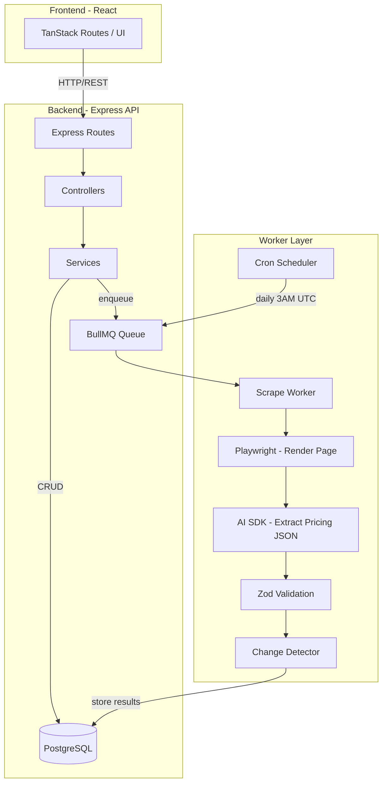

# Competitor Tracking Core Implementation Plan

## Architecture Overview



---

## 1. Infrastructure: Redis + Dependencies

Add Redis to `docker-compose.yml` alongside existing PostgreSQL. Install npm dependencies.

**New dependencies:**

- `bullmq` -- job queue
- `ioredis` -- Redis client (BullMQ peer dep)
- `playwright` -- headless browser
- `ai` -- Vercel AI SDK for LLM extraction
- `@ai-sdk/openai` -- OpenAI provider for AI SDK

**New env vars** in `src/env.ts`:

- `REDIS_HOST`, `REDIS_PORT`
- `OPENAI_API_KEY`

---

## 2. Database Schema

Create `src/database/schema/competitor.ts` following the existing Drizzle pattern in `src/database/schema/user.ts`. Five tables:

### `competitor`

| Column                | Type            | Notes                                    |
| --------------------- | --------------- | ---------------------------------------- |
| id                    | uuid PK         | `gen_random_uuid()`                      |
| userId                | text FK -> user | owner                                    |
| name                  | text            | competitor display name                  |
| pricingUrl            | text            | HTTPS pricing page URL                   |
| status                | text            | `active`, `paused`, `failed`, `archived` |
| consecutiveFailures   | integer         | default 0, reset on success              |
| lastScrapedAt         | timestamp       | nullable                                 |
| createdAt / updatedAt | timestamp       | standard                                 |

### `scrapeJob`

| Column                  | Type      | Notes                                          |
| ----------------------- | --------- | ---------------------------------------------- |
| id                      | uuid PK   |                                                |
| competitorId            | uuid FK   |                                                |
| status                  | text      | `pending`, `inProgress`, `completed`, `failed` |
| triggeredBy             | text      | `manual` or `scheduled`                        |
| errorMessage            | text      | nullable, for failed jobs                      |
| retryCount              | integer   | default 0, max 3                               |
| startedAt / completedAt | timestamp | nullable                                       |
| createdAt               | timestamp |                                                |

### `priceSnapshot`

| Column       | Type      | Notes |
| ------------ | --------- | ----- |
| id           | uuid PK   |       |
| competitorId | uuid FK   |       |
| scrapeJobId  | uuid FK   |       |
| scrapedAt    | timestamp |       |

### `pricingPlan`

| Column        | Type    | Notes                          |
| ------------- | ------- | ------------------------------ |
| id            | uuid PK |                                |
| snapshotId    | uuid FK |                                |
| name          | text    | plan name (e.g. "Pro")         |
| price         | numeric | cents or decimal               |
| billingPeriod | text    | `monthly`, `yearly`, `oneTime` |
| currency      | text    | default `USD`                  |
| features      | jsonb   | string array, nullable         |
| position      | integer | display order from page        |

### `priceChange`

| Column                   | Type      | Notes                                                                           |
| ------------------------ | --------- | ------------------------------------------------------------------------------- |
| id                       | uuid PK   |                                                                                 |
| competitorId             | uuid FK   |                                                                                 |
| snapshotId               | uuid FK   | new snapshot                                                                    |
| previousSnapshotId       | uuid FK   |                                                                                 |
| changeType               | text      | `increase`, `decrease`, `planAdded`, `planRemoved`, `featuresChanged`, `noChange` |
| planName                 | text      |                                                                                 |
| previousPrice / newPrice | numeric   | nullable                                                                        |
| percentageChange         | numeric   | nullable                                                                        |
| featuresAdded            | jsonb     | array of new features, nullable                                                 |
| featuresRemoved          | jsonb     | array of removed features, nullable                                             |
| detectedAt               | timestamp |                                                                                 |

Register all tables in `src/database/database.ts` schema object.

---

## 3. Scraping Pipeline (the core)

Create `src/features/competitor-tracking/services/scraper.ts`

### Step-by-step flow:

```
1. Playwright launches headless Chromium
2. Navigate to pricingUrl (30s timeout)
3. Wait for page to settle (networkidle)
4. Extract page text content (stripped of scripts/styles)
5. Send to OpenAI with structured output prompt
6. Validate response with Zod schema
7. Return structured PricingPlan[] or throw
```

### LLM Extraction Strategy

Use **Vercel AI SDK** with structured outputs (`generateObject`) and a Zod schema:

```typescript
import { generateObject } from 'ai'
import { openai } from '@ai-sdk/openai'

const PricingExtractionSchema = z.object({
  plans: z.array(z.object({
    name: z.string(),
    price: z.number().nullable(),        // null for "Contact us" / custom
    billingPeriod: z.enum(["monthly", "yearly", "oneTime"]),
    currency: z.string().default("USD"),
    features: z.array(z.string()).optional(),
  })),
  confidence: z.enum(["high", "medium", "low"]),
  rawPriceStrings: z.array(z.string()),  // for debugging
})

const result = await generateObject({
  model: openai('gpt-4o'),
  schema: PricingExtractionSchema,
  system: "You are a SaaS pricing page analyzer...",
  prompt: `Extract pricing plans from this page: ${pageText}`,
})
```

**Prompt design (key for stability):**

- System prompt establishes role as "SaaS pricing page analyzer"
- Includes explicit instructions: extract ALL visible pricing plans, normalize prices to numbers, identify billing period
- Handles edge cases: "Contact us" plans (price = null), annual vs monthly toggle, per-seat pricing
- Asks LLM to report confidence level -- if `low`, mark scrape as potentially unreliable

**Stability measures:**

- If LLM returns 0 plans, treat as `failed`
- If confidence is `low`, log warning but still store (mark as low confidence)
- Truncate page text to ~8K tokens to control cost and stay within context
- Cache Playwright browser instance (reuse across scrapes in the same worker cycle)

---

## 4. Change Detection

Create `src/features/competitor-tracking/services/change-detector.ts`

Compares new snapshot plans against the **most recent previous successful snapshot** for the same competitor:

- **Plan matching**: Match by plan name (case-insensitive, fuzzy tolerance for minor name changes)
- **`increase`/`decrease`**: Same plan exists in both, price differs by >= 5%
- **`planAdded`**: Plan exists in new but not previous. Per spec: only confirm after 2 consecutive scrapes (store as `tentativePlanAdded` and confirm on next scrape)
- **`planRemoved`**: Plan exists in previous but not new
- **`featuresChanged`**: Same plan exists in both, price unchanged (within 5%), but features array differs (added, removed, or modified features)
- **`noChange`**: All plans match within 5% threshold AND features unchanged

**Feature comparison logic:**
- Normalize features (trim whitespace, lowercase for comparison)
- Detect additions: features in new but not in previous
- Detect removals: features in previous but not in new
- If any additions or removals detected, mark as `featuresChanged`

**Priority when multiple changes occur:**
1. If price changed >= 5%: `increase` or `decrease` (takes priority over feature changes)
2. If price unchanged but features changed: `featuresChanged`
3. If plan is new: `planAdded`
4. If plan is missing: `planRemoved`

---

## 5. BullMQ Worker + Scheduler

### Queue setup: `src/features/competitor-tracking/queue/connection.ts`

- Create shared Redis connection using `ioredis`
- Define queue name: `competitor-scraping`

### Worker: `src/features/competitor-tracking/queue/scrape-worker.ts`

- Processes jobs from the queue
- Each job: receives `{ competitorId, scrapeJobId, triggeredBy }`
- Flow:
  1. Update `scrapeJob.status` to `inProgress`
  2. Call scraper service
  3. On success: store snapshot + plans, run change detection, reset `consecutiveFailures`, update `lastScrapedAt`
  4. On failure: increment `retryCount`. If < 3, re-enqueue with 5-min delay. If >= 3, increment `consecutiveFailures` on competitor. If `consecutiveFailures` >= 3, set `CompetitorStatus` to `failed`
- **Concurrency**: Process 3 jobs at a time (avoid overwhelming LLM API)
- **Timeout**: 60s per job (30s Playwright + 30s buffer for LLM)

### Scheduler: `src/features/competitor-tracking/queue/scheduler.ts`

- BullMQ `QueueScheduler` or repeatable job pattern
- Daily at 3:00 AM UTC: query all `active` competitors, enqueue a scrape job for each
- Respect rate limit: max 50 competitors per day

### Worker startup

- Register worker in a separate entry point or hook into TanStack Start's server startup
- Recommend: add an `npm run worker` script that runs the worker process independently

---

## 6. Server Actions (CRUD)

Create under `src/features/competitor-tracking/actions/`:

### `add-competitor.ts`

- Input: `{ name, pricingUrl }`
- Validates HTTPS URL, checks for duplicates, checks tier limits (free: 1 max)
- Creates competitor with `status: active`
- Creates scrapeJob with `status: pending`
- Enqueues immediate scrape via BullMQ
- Uses `authenticated` middleware for session

### `edit-competitor.ts`

- Input: `{ competitorId, name?, pricingUrl? }`
- If URL changed: reset `consecutiveFailures`, trigger new scrape

### `update-competitor-status.ts`

- Input: `{ competitorId, status }`
- Enforces valid state transitions per spec workflow
- On `paused` -> `active` or `archived` -> `active`: enqueue immediate scrape
- On `active` -> `archived`: no more scraping

### `trigger-manual-scrape.ts`

- Input: `{ competitorId }`
- Enforces 30-min cooldown (check `lastScrapedAt`)
- Only when status is `active` or `paused`
- Enqueues job via BullMQ

### `get-competitors.ts`

- Input: `{ status?, search?, sortBy?, cursor? }`
- Returns paginated list with computed fields (plan count, latest change type, min/max prices)
- Defaults: `active` status, sorted by most recently scraped

### `get-competitor-detail.ts`

- Input: `{ competitorId }`
- Returns competitor + current plans + price history (last 90 days) + change log

### `get-price-comparison.ts`

- Input: `{ competitorIds?, dateRange? }`
- Returns side-by-side pricing data for selected competitors

### `export-competitor-csv.ts`

- Generates CSV of competitor pricing data

---

## 7. Key File Structure

```
apps/backend/src/
  database/
    schema/
      competitor.ts              # All 5 tables + relations
  features/
    competitor-tracking/
      routes/
        competitor.routes.ts     # Express routes
      controllers/
        competitor.controller.ts # Request handlers
      services/
        scraper.ts               # Playwright + AI SDK extraction
        change-detector.ts       # Diff logic between snapshots
        url-validator.ts         # HTTPS validation + accessibility check
      queue/
        connection.ts            # Redis/BullMQ shared connection
        scrape-queue.ts          # Queue definition + helper to enqueue
        scrape-worker.ts         # Job processor
        scheduler.ts             # Daily cron setup
      schemas/
        extraction.ts            # Zod schemas for LLM output
        validation.ts            # Input validation schemas
  main.ts                        # Express app entry point
```

---

## 8. Production Stability Measures

- **Playwright**: Run in Docker with `mcr.microsoft.com/playwright` image for consistent rendering. Set `--no-sandbox` in production. Reuse browser instance across jobs in a worker cycle.
- **LLM fallback**: If AI SDK call fails (rate limit, timeout), retry once. If still fails, mark job as failed (will be retried by BullMQ).
- **Idempotency**: Scrape jobs are idempotent -- re-processing the same job overwrites the snapshot for that scrapeJobId.
- **Rate limiting**: BullMQ rate limiter: max 50 jobs per 24h window. Manual scrape cooldown enforced at action level.
- **Graceful shutdown**: Worker listens for SIGTERM, finishes current job before exiting.
- **Monitoring**: Log all scrape attempts with timing, token usage, confidence level. Store error messages in `scrapeJob.errorMessage`.
